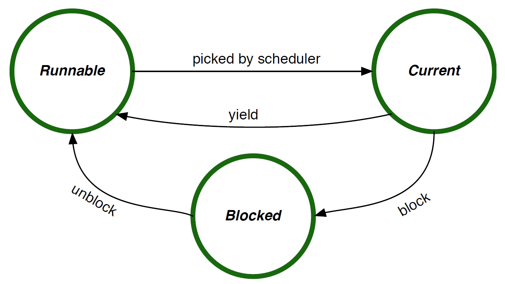

<!-- %title eChronos RTOS Manual: Rigel Variant -->
<!-- %version 0.2 -->
<!-- %docid Wq8tAN -->

# Introduction

This document provides the information that system designers and application developers require to successfully create reliable and efficient embedded applications with the eChronos real-time operating system.

The [Concepts] chapter presents the fundamental ideas and functionalities realized by the RTOS and how developers can harness them to successfully construct systems.

The [API Reference] chapter documents the details of the run-time programming interface that applications use to interact with the RTOS.

The [Configuration Reference] chapter details the interface to the build-time configuration of the RTOS that system designers use to tailor the RTOS to their applications.

Throughout this document, *eChronos RTOS* or *the RTOS* will refer specifically to the *Rigel* variant of the eChronos RTOS.

# Concepts

This chapter introduces the concepts that form the foundation of the RTOS.
Many of these concepts would be familiar to readers who have experience in other real-time operating systems.
However, this chapter does cover aspects that are specific to the RTOS and significant for constructing correct systems.

In addition to this documentation, RTOS training can provide a more hands-on, practical introduction to the RTOS.

## Overview

The eChronos RTOS facilitates the rapid development of reliable, high-performance embedded applications.
It allows developers to focus on the application logic by wrapping the complexities of low-level platform and system code in a comprehensive, easy-to-use operating-system API.
Since each application configures the RTOS to its specific requirements, this document refers to the combination of RTOS and application code simply as the *system*.

In terms of its functionality, the RTOS is a task-based operating system that multiplexes the available CPU time between tasks.
Since it is non-preemptive, tasks execute on the CPU until they voluntarily relinquish the CPU by calling an appropriate RTOS API function.
The RTOS API (see [API Reference]) gives tasks access to the objects that the RTOS provides.
They include [Interrupt Service Routines], [Signals], [Time and Timers], [Mutexes], and [Message Queues].

A distinctive feature of the RTOS is that these objects, including tasks, are defined and configured at build time (see [Configuration Reference]), not at run time.
This configuration defines, for example, the tasks and mutexes that exist in a system at compile and run time.
Static system configuration like this is typical for small embedded systems.
It avoids the need for dynamic memory allocation and permits a much higher degree of code optimization.
The [Configuration Reference] chapter describes the available configuration options for each type of object in the RTOS.

## Startup

The RTOS does not start automatically when a system boots.
Instead, the system is expected to start normally, as per the platform's conventions and C runtime environment.
The C runtime environment invokes the canonical `main` function without any involvement of the RTOS.
This allows the user to customize how the system is initialized before starting the RTOS.

The RTOS provides a [start] API that needs to be called to initialize the RTOS and begin its execution.
The [start] API never returns.
Any tasks that are marked as auto-start are automatically started by the RTOS.
All other tasks are initially in the blocked state, waiting to receive a start signal.
A start signal can be sent to a task via the [task_start] API.

There is no API to shut down or stop the RTOS once it has started.

## Error Handling

There are some rare cases in which the RTOS may detect a fatal error state.
Fatal errors include, for example, the fact that the timer component is unable to process a timer tick before another tick occurs.
How such error states are handled best depends to a large degree on the application and system requirements.
Therefore, the RTOS allows applications to customize the response to error states.

When the RTOS detects an error state, it calls the application-provided function [`fatal_error`].
The application can implement its preferred strategy to deal with error states this way, where typical approaches are to log the error state and reset the system.
The RTOS supplies a single [ErrorId] parameter to the application's [`fatal_error`] function that indicates the kind of error that occurred.

The RTOS relies on [`fatal_error`] to not return, so it must stop the system and prevent the RTOS and application from continuing to execute.
This also means that the [`fatal_error`] function must not use any RTOS APIs.

### Assertions

A particular instance of error states is when an assertion in the RTOS implementation fails.
There two kinds of such assertions:
API assertions and internal assertions.
Both kinds are optional and can be enabled or disabled in the system configuration (see [Error Handling Configuration]).

API assertions check a wide range of (but not all) requirements and preconditions that the RTOS API has regarding application run-time behavior.
For example, the [mutex_lock] API implementation can assert that the mutex ID that the application provides identifies a valid mutex.
All such assertions cover requirements and preconditions that are clearly documented.
It is good practice for applications to enable these assertions via the [`api_asserts`] configuration item for debugging and test builds.
It is recommended to disable them in release builds to avoid the code-size and execution-time costs they incur.

Internal assertions check a (relatively small) range of internal assumptions of the RTOS implementation that are not related to the application behavior.
These implementation-specific sanity checks are irrelevant to applications and primarily intended for testing and debugging the RTOS implementation itself.
Applications are free to enable them via the [`internal_asserts`] configuration item.
However, they provide no tangible benefit to applications and they do incur code-size and execution-time overhead.

## Tasks

As the core mechanism of the RTOS, tasks are the basic building blocks for structuring complex systems.
Tasks provide independent control flows that can, on the one hand, be easily understood, implemented, and maintained.
On the other hand, they interact with each other via the RTOS APIs to form a complete application and provide its full functionality.

### Task and System Structure

In general, a CPU executes a stream of instructions that modify internal state (registers and memory) and control external devices.
The challenge for an application developer is to work out which instructions should be executed to obtain the desired application behavior.

For systems with simple requirements this can be easily achieved with a single big-loop design.
However as the inherent complexity of requirements increases, a single big-loop becomes too complicated to effectively develop, reason about, or debug.

The diagram below shows an example of this big-loop design.
As more demands are placed on the system, the code in the *logic* part of the code becomes too complicated.

<table width="100%"><tr width="100%">
<td class="codebox" width="100%"><pre>void main(void)
{
    for (;;) {
        /*... logic A ...*/

        /*... logic B ...*/

        /*... logic C ...*/
    }
}</pre></td></tr></table>

There are multiple ways that a system designer could start to address this complexity.
The overarching design principle is separation of concerns, where logic that addresses different aspects of the system are separated in some manner to make the complexity more manageable.
One approach to decomposing a system is to structure the functionality so that rather than a single large loop, there are multiple smaller loops, each performing a cohesive set of actions.

The RTOS implements this abstraction by providing tasks.
Each task in the system executes its own loop, and the RTOS provides the underlying mechanism for switching the CPU from one task to another.

The diagram below shows three tasks, A, B and C, each with their own loop.
The logic for each of these should be simpler than the case where this logic is mixed in a single big loop.
The arrows show how each task executes independently on the underlying CPU.
The end of each arrow represents the point in time where the RTOS switches the CPU from running one task to running a different task.

<table width="100%"><tr width="100%">
<td width="33%" class="codebox"><pre>void task_a(void)
{
    for (;;) {
        /*... logic A ...*/
    }
}</pre></td>
<td width="33%" class="codebox"><pre>void task_b(void)
{
    for (;;) {
        /*... logic B ...*/
    }
}</pre></td>
<td width="33%" class="codebox"><pre>void task_c(void)
{
    for (;;) {
        /*... logic C ...*/
    }
}</pre></td>
</tr></table>

### Task Names

Each task in the system has a unique name chosen and configured by the system designer.
The name is an ASCII string[^task_names] and should describe the functionality of the task (also see the [`tasks/task/name`] configuration item).

Within the RTOS and the application implementation, task names translate to constants of type [TaskId].
Each task has a unique [TaskId] which is assigned automatically by the RTOS configuration tool.
The RTOS configuration tool generates a symbolic macro of the form [`TASK_ID_<name>`].
Application code should use this symbolic macro rather than directly using integer values to refer to tasks.

[^task_names]: There are some additional restrictions on valid names.
See the [Configuration Reference] section for more details.

### Task Functions

Each task in the system is configured with a function that serves as the entry point into the implementation of the given task's functionality.
The RTOS sets up each task such that when it is started, it begins its execution with this function.
Task functions are configured statically together with the other task properties (also see [`tasks/task/function`]).

For the RTOS to correctly call a task's function, it must have the type signature `void fn(void)`.
That is, it shall have no arguments because the RTOS does not supply any arguments to task functions.
Furthermore, it is an implementation error for a task function to return.
The effect of a task function returning is generally undefined, but it may result in a fatal error state (see [Error Handling]).

Although it is a less common system design, multiple tasks may share the same task function because they run on separate stacks.
However, such a setup requires particular care with regard to concurrent access to shared data structures and resources.

### Task Stacks

Each task in the system has its own unique stack.
Stacks are created and set up by the RTOS configuration and runtime environment, so a system designer's main concern with stacks is choosing an appropriate size.

Stacks are used for several purposes while an application runs:

- The primary user of a stack is the task code itself as it holds variables and return addresses during function calls.

- Additionally, when the RTOS performs a task switch away from a task, it saves that task's context (such as its register values) on its stack.

- Furthermore, [Interrupt Service Routines] use the stack of the task they interrupt.

The size of each stack is chosen by the system designer and configured statically and individually for each task (see the [`tasks/task/stack_size`] configuration item in the [Task Configuration] Section).
This size needs to be chosen carefully to ensure that there is sufficient space on the stack for all the kinds of stack usage listed above.

The effect of a stack overflow, when a task, the RTOS, or one or more ISRs require more than the available stack space, is generally undefined.
On some target platforms, the RTOS may support available hardware or software mechanisms to detect stack overflows.

### Task Switching

The task that is actively executing on the CPU is known as the current task (also see the [task_current] API).
To multiplex multiple tasks on a single CPU, the RTOS implements a context switching mechanism for changing the current task.
The task's context refers to all the state associated with the task but for which the underlying hardware can support only one copy at a time.
Specifically, the processor only supports a single program counter, stack pointer, and register state.
During a context switch, the RTOS saves the current task's state on the task's stack and then restores the state for the new current task.

The [Preemption] section provides more details on context switches, what can lead to them, and how to control them, which is an important aspect of constructing correct system behavior.

### Task States

An RTOS task can be in one of three primary states: current, runnable, or blocked.
Tasks within a system do no usually operate in isolation;
they interact with other tasks, devices, and the external environment.
When interacting with another entity, the RTOS provides mechanisms so that the task can wait until the other entity is ready, rather than the task needing to constantly poll the other entity.
When a task is waiting, it moves into the blocked state.
There are a number of RTOS operations that cause a task to block, such as waiting for a signal, locking a mutex, or sleeping.
When a task is in the blocked state, it is no longer current, so the RTOS must choose another runnable task to become the current task.
The blocked task unblocks and becomes runnable when the entity it is waiting on is ready, e.g., when a signal is delivered, a mutex is available, or a sleep duration has completed.

It is possible for the overall system to arrive in a state where all tasks are in the blocked state.
In this situation, there is no current task and the system behavior depends on the RTOS variant and platform implementation.
When the variant and platform implementation supports an idle state in the absence of runnable tasks, interrupts may still occur and interrupt handlers are still processed.
Tasks may become runnable again when an interrupt handler unblocks a task via an interrupt event (see [Interrupt Events]).
If the platform supports it, the RTOS places the hardware into a low-power state while the system is idle[^blocked_state].

[^blocked_state]: In a system designed to operate with low power consumption, it is desirable for this to be the case most of the time.

When there is more than one task in the runnable state, the RTOS must use the scheduling algorithm to determine the task that becomes current.
The scheduling algorithm is described in the [Scheduling Algorithm] section.

# API Reference

This chapter describes the runtime application programming interface (APIs) provided by the RTOS.

## Correct API Usage

The RTOS API design and implementation leave room for the application to use it incorrectly.
For example, there are generally no safeguards in the RTOS itself against the application supplying invalid task-ID values to API functions.
To achieve correct system behavior, it is the application's responsibility to use the RTOS API under the conditions and requirements documented here.

The RTOS implementation is able to detect some case of the application using the RTOS API incorrectly.
This feature needs to be enabled in the system configuration (see [`api_asserts`]).
When enabled, the RTOS checks some but not all cases of the API being used incorrectly.
If it detects such a case, it calls the `fatal_error` function.

## Types

The RTOS defines a number of *types* that are used in the API.
Most types are implemented as unsigned integers (e.g: `uint8_t`).
Unfortunately, the C language performs type checking only on the underlying types, but ignores any type definitions (`typedef`s).
It is recommended that a suitable static analysis or lint tool is used to ensure that application code is using the correct types when calling APIs.

## Constant Definitions

The RTOS defines a number of pre-processor macros as constants.
Ideally these would be made available as typed static constant variables, however some compilers do not always generate optimal code for that case, so a pre-processor macro is used instead.

## Functions vs. Macros

Some compilers do not support function inlining.
For performance or code space considerations, some APIs described in this chapter are implemented as function-like macros.
This is an implementation detail and the use of all APIs must conform to the formal function definitions provided in this chapter.

## Core API

### start

void start(void);

The [start] API initializes the RTOS, makes all tasks configured as auto-start runnable and then, based on the scheduling algorithm, chooses and starts executing the current task.
This function must be called from the system's main function.
This function does not return.

### task_start

void task_start(TaskId task);

The [task_start] API starts the specified task.
This API must be called only once for each task that is not automatically started by the RTOS.
This function is merely a convenience function for sending `SIGNAL_SET_START` to the function.

### yield

void yield(void);

The [yield] API causes a context switch to a runnable task in the system.
That task is determined by the scheduler.
If the current task is the only runnable task in the system, [yield] returns without a context switch.
Each task must yield (or block) at least once per timer period to ensure that ticks are correctly processed and that all tasks receive a share of execution time on the CPU.
When yielding (or blocking), any raised interrupt events are processed.

### sleep

void sleep(TicksRelative ticks);

The [sleep] API blocks the current task for the specified number of timer ticks.
After `ticks` timer ticks, the task becomes runnable again.
Note that that does not immediately make it the current task again.
See the [Time and Timers] section for further information on timing and scheduling considerations.

## Error Handling API

### ErrorId

An instance of this type refers to a specific RTOS error state.
When the RTOS detects an error state, it passes a value of type [ErrorId] to the [`fatal_error`] function, which the application needs to implement.
The RTOS implementation defines constants that identify all potential error states and the corresponding [ErrorId] values.
The names of these constants follow the pattern `ERROR_ID_<error-state>`.

## Task API

### TaskId

Instances of this type identify specific tasks.
The underlying type is an unsigned integer of a size large enough to represent all tasks[^task_id_type].
The [TaskId] should generally be treated as an opaque value.
Arithmetic operations should not be used on a [TaskId].

The application may assume that a [TaskId] is in the range [TASK_ID_ZERO] through [TASK_ID_MAX].
For example, if a per-task data structure is required, it is valid to use a fixed size array and index the array by using the [TaskId].
For iterating over such an array, it is valid use to increment an instance of [TaskId], however care must be taken to ensure the resulting value is in range.
[TaskId] instances can be tested for equality, however other logical operations (e.g., comparison) should not be used.
For all tasks in the system, the configuration tool creates a constant with the name `TASK_ID_<name>` that should be used in preference to raw values.

[^task_id_type]: This is normally a `uint8_t`.

### TASK_ID_ZERO

This constant has the type [TaskId] and represents the task with the numerically lowest task ID in the system.
This can be used in cases where application code wishes to iterate over all tasks in the system.

### TASK_ID_MAX

This constant has the type [TaskId] and represents the task with the numerically highest task ID in the system.
This can be used in cases where application code wishes to iterate over all tasks in the system.

### `TASK_ID_<name>`

These constants have the type [TaskId].
A constant is created for each task in the system, where `<name>` is the upper-case conversion of the task's name (see [Task Names]).

### task_current

TaskId task_current(void);

This function returns the task ID for the current task.

# Configuration Reference

This chapter provides a description of the available configuration items for the RTOS.
The RTOS is configured via the configuration tool called `prj`[^prj_manual].

[^prj_manual]: See `prj` manual for more details.

### Types

Configuration items have one of a number of different types.

- Boolean values are either true or false.

- Integers are numbers of arbitrary size specified in standard base-10 notation.

- C identifiers are strings that are valid identifiers in the C language (and generally refer to a function or variable that is available in the final system).

- Identifiers are strings used to name the different RTOS objects.
Identifiers must be lower-case string consisting of ASCII letters, digits and the underscore symbol.
Identifiers must start with a lower-case ASCII letter.

### Notation

Since the system configuration is specified in XML format, the configuration items form a hierarchy of elements.
For example, the list of tasks contains an entry for each task where in each entry several task-specific items are nested.

For clarity, this document refers to each item through a notation similar to [XPath](http://www.w3.org/TR/xpath).
For example, the *name* property of a task in the tasks component would be referred to as *tasks/task/name*.
It reflects not only the name of the property itself but also its location within the hierarchy of an entire system definition.

## RTOS Configuration

### `prefix`

In some cases the RTOS APIs may conflict with existing symbol or pre-processor macro names used in a system.
Therefore, the RTOS gives system designers the option to prefix all RTOS APIs to help avoid name-space conflicts.
The prefix must be an all lower-case, legal C identifier.
This is an optional configuration item that defaults to the empty string, i.e., no prefix.

The following examples are based on `prefix` having the value `rtos`.

* functions and variables: lower-case version of `prefix` plus an underscore, so [start] becomes `rtos_start` and [task_current] becomes `rtos_task_current`.

* types: CamelCase version of `prefix`, so [TaskId] becomes `RtosTaskId`.

* constants: upper-case version of `prefix` plus an underscore, so [TASK_ID_ZERO] becomes `RTOS_TASK_ID_ZERO`.

## Error Handling Configuration

### `api_asserts`

This configuration item is a boolean with a default of false.
When true, the RTOS checks the arguments passed to API functions at runtime for consistency.
For example, it checks whether identifiers for RTOS objects passed to API functions identify valid objects.
If the check passes, the check has no effect on the behavior of the API.
If the check fails, the RTOS calls the [`fatal_error`] function.

### `internal_asserts`

This configuration item is a boolean with a default of false.
When true, the RTOS checks internal implementation state for consistency at runtime.
For example, it checks whether the [TaskId] instance identifying the current task is a valid task ID.
If the check passes, the check has no effect on the behavior of the RTOS.
If the check fails, the RTOS calls the [`fatal_error`] function.

### `fatal_error`

This configuration item is an optional C identifier with no default.
It must be the name of a C function which the application implements and the RTOS calls when a fatal error state occurs.
See Section [Error Handling] for more information.

## Task Configuration

### `taskid_size`

This integer configuration item provides control over the maximum number of tasks in the system.
It determines the bit width of the [TaskId] type.
When this items is configured to integer value _n_, the maximum number of tasks supported by the system is _2^n - 1_.
The default value for this configuration item is _8_, resulting in a maximum of 255 tasks by default.

### `tasks`

This configuration item is a list of `task` configuration objects.
The configuration must include at least one task because a system without tasks cannot run application functionality.

### `tasks/task/name`

This configuration item specifies the task's name (also see [Task Names]).
Each task must have a unique name.
The name must be of an identifier type.
This is a mandatory configuration item with no default.

### `tasks/task/function`

This configuration item specifies the task's function (also see [Task Functions]).
It must be the name of a function that the application implements so that it is available at link time.
This is a mandatory configuration item with no default.

### `tasks/task/stack_size`

This configuration item specifies the task's stack size in bytes (also see [Task Stacks]).
It is a mandatory configuration item with no default.

### `tasks/task/start`

This boolean configuration option determines whether a task should automatically start when the RTOS is started.
If the task is not automatically started, it can be started using the [task_start] API.
This is an optional configuration item that defaults to false.
At least one task in the system should be configured with `start` as true, otherwise no task and hence no application functionality can ever start running in the system.

